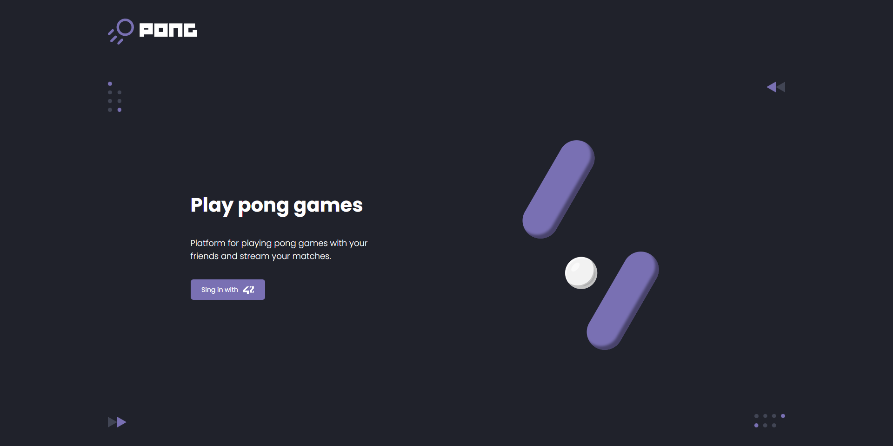
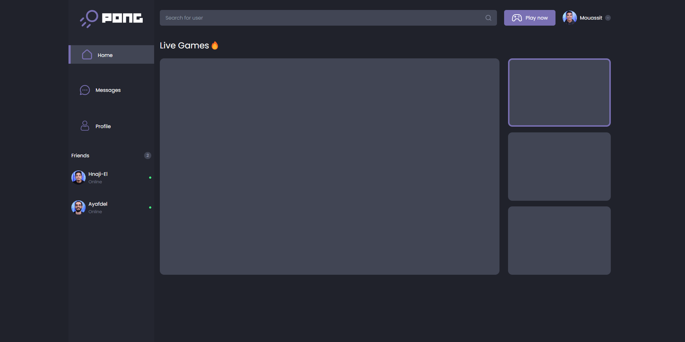
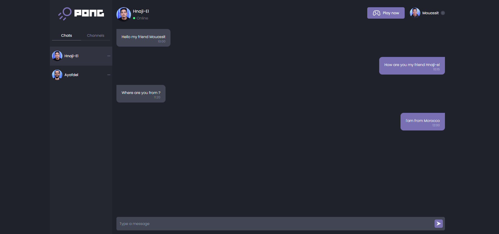
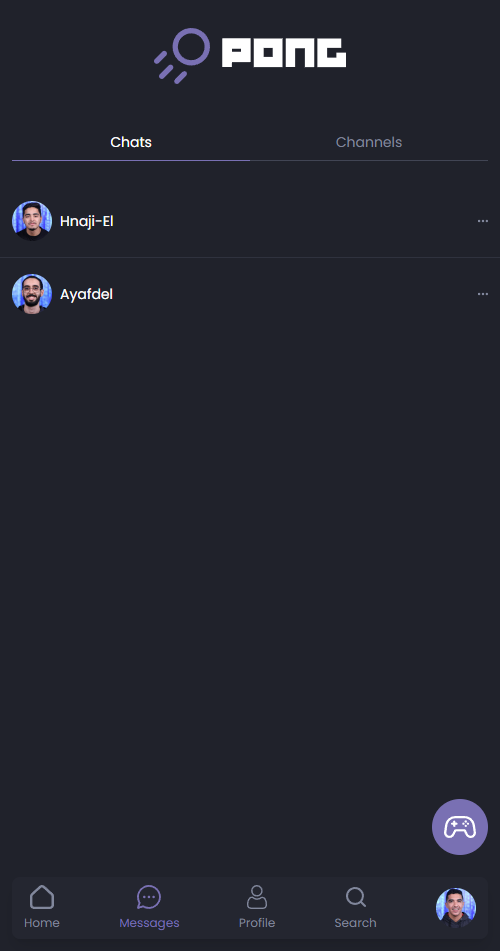
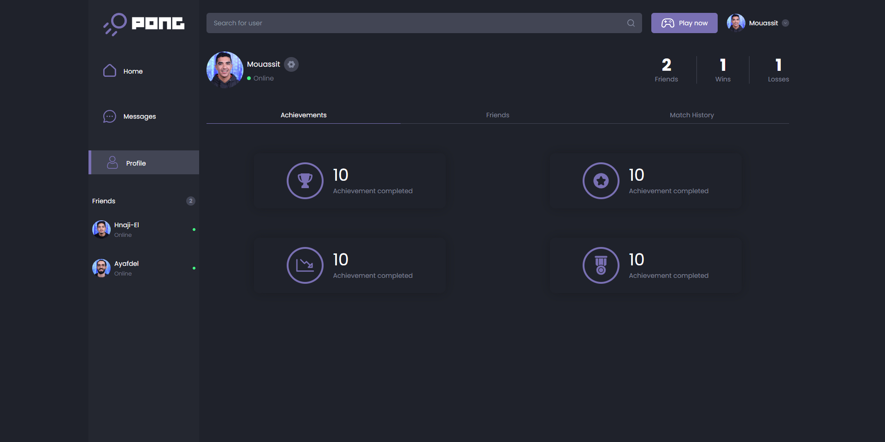

# ft_transcendence

## Welcome! 👋

This is a group (4) project which is about creating a website for the mighty Pong contest!
where things like: Security concerns - User Account - Chat - Game are the main things in
the project. I was responsible for the front end part using: REACT JS - TAILWIND CSS -
CHAKRA UI and Typescript as a must-use programming language.

## Features

- Game
- Chat
- Live Games
- User Account

## ScreenShots

## Made By

<table>
  <tr>
    <td align="center"><a href="https://github.com/mouasit"> <b>Mustapha Ouasit</b></a> </td>
    <td align="center"><a href="https://github.com/hnaji-el"> <b>Hamid Naji El Idrissi</b></a> </td>
    <td align="center"><a href="https://github.com/Lowkey98"> <b>Ayoub Afdel</b></a> </td>
  </tr>
</table>

## Demo

To use the ft_transcendence, simply navigate to the URL where it is hosted: https://mouasit.github.io/ft_transcendence_demo
